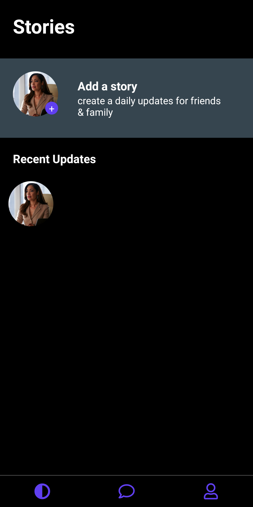
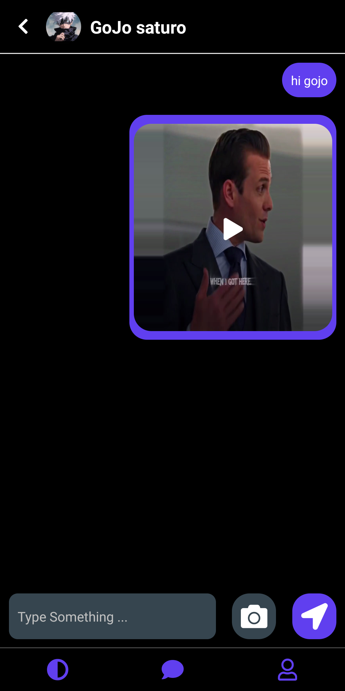
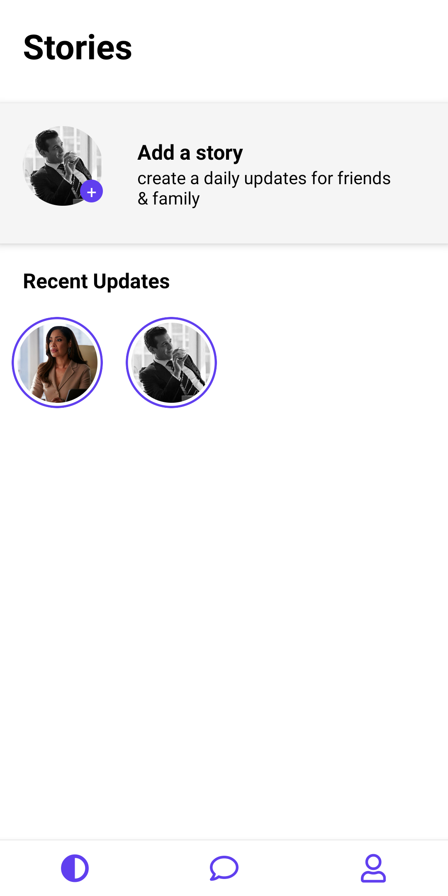

# Chatify

A peer to peer chat application same as Whatsapp made with firebase services firestore,storage etc.


## Installation
please make sure you have react native environment setted up if not look into https://reactnative.dev/docs/environment-setup. 
clone the repo and then

```bash
  cd Chatify
```

```bash
  yarn
```

```bash
  npx react-native run-android
```
    
## Lessons Learned

Ok , by making this project i brushed up my Typescript and Animations skills on some extent. Plus here i desgined my backend with NoSql. I learnt denormalised structure to optimise quary reads. so project have

- Typescript
- firebase 
- redux toolkit
- basic Animations
- dark/light mode


## Tech Stack

**Client:** React Native, Redux-ToolKit, Typescript, Jest, React-Native Testing Library

**Server:** firebase


## ScreenShots
<table>
<tr>
<td>

</td>
<td>

</td>
<td>

</td>
<td>

</td>
</tr>
<tr>
<td>

</td>
<td>

</td>
<td>

</td>
<td>

</td>
</tr>
</table>
## Features

- Light/dark mode toggle
- story viewer same as whatsapp
- Real Time peer to peer chat along with photos and videos
- Cross Platform


## Running Tests

To run tests, run the following command

```bash
  yarn test
```


## LinkedIn

- [mahendra-gohil](https://www.linkedin.com/in/mahendra-gohil-175678183/)

