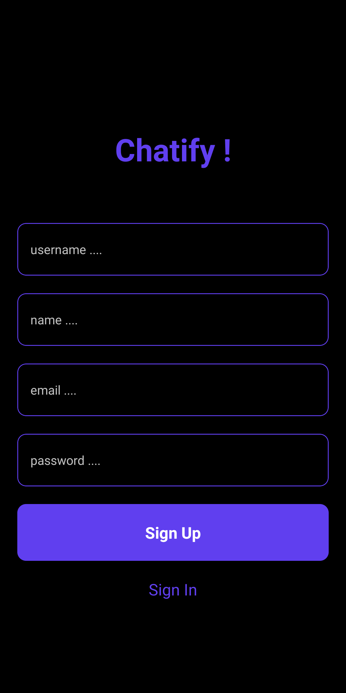
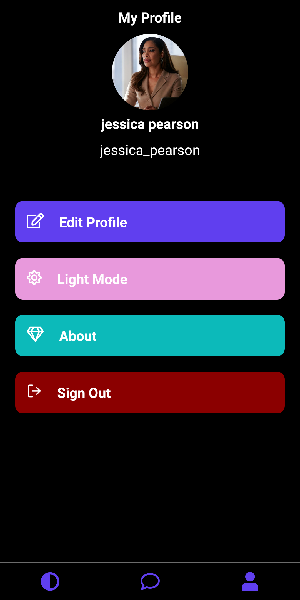
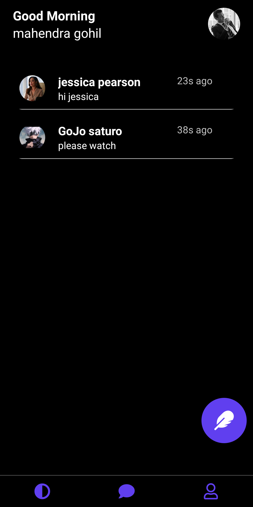

# Chatify

A peer to peer chat application same as Whatsapp made with firebase services firestore,storage etc.

## Features

- Light/dark mode toggle
- story viewer same as whatsapp
- Real Time peer to peer chat along with photos and videos
- Cross Platform

## Installation
please make sure you have react native environment setted up if not look into https://reactnative.dev/docs/environment-setup. 
clone the repo and then

```bash
  cd Chatify
```

```bash
  yarn
```

```bash
  npx react-native run-android
```
    
## Firebase rules - firestore
```
rules_version = '2';

service cloud.firestore {
  match /databases/{database}/documents {

    // This rule allows anyone with your Firestore database reference to view, edit,
    // and delete all data in your Firestore database. It is useful for getting
    // started, but it is configured to expire after 30 days because it
    // leaves your app open to attackers. At that time, all client
    // requests to your Firestore database will be denied.
    //
    // Make sure to write security rules for your app before that time, or else
    // all client requests to your Firestore database will be denied until you Update
    // your rules
    //   match /{document=**} {
    //   allow read, write,update: if request.auth != null;
    // }
      match /users/{userId=*} {
        allow read: if request.auth != null;
        allow create, update: if request.auth != null && request.auth.uid == userId;
      }
      match /usernames/{allPaths=**}
      {
      	allow read: if true;
        allow create,update: if request.auth != null;
      }
      match /stories/{document=**}
      {
      	allow read: if request.auth != null;
   		}
      match /stories/{userId}/{allPaths=**}
      {
   			allow create, update: if request.auth != null && request.auth.uid == userId;
   		}
      match /stories/{userId}/userStories/{document=**} {
      	allow read: if request.auth != null;
    	}
      match /stories/{userId}/viewers/{viewerId} {
        allow read: if request.auth != null;
      }
    
      match /stories/{userId}/viewers/{viewerId=*} {
        allow read: if request.auth != null
        allow update,create,write: if request.auth != null && request.auth.uid == viewerId;
      }

      match /messages/{allPaths=**}
      {
          allow read: if request.auth != null
          allow create,update: if request.auth != null
      }
//       match /messages/{userId}/groups/{otherUserId} {
//       allow create: if request.auth.uid == userId
//                    && !exists(/databases/$(database)/documents/messages/$(userId)/groups/$(otherUserId));
//       allow read, write: if request.auth.uid == userId || request.auth.uid == otherUserId;
//       }
    
//       // Allow group chat messaging (if applicable)
//       match /messages/{userId}/groups/{otherUserId}/{allPaths=**} {
//         allow read: if request.auth.uid == userId || request.auth.uid == otherUserId;
//         allow write, update: if request.auth.uid == userId || request.auth.uid == otherUserId;
//       }

//       // Allow message creation in peer-to-peer and group chats
//       match /messages/{userId}/groups/{otherUserId}/groupMessages/{messageId} {
//         allow create: if request.auth.uid == userId;
//         allow read, write, update: if request.auth.uid == userId || request.auth.uid == otherUserId;
//       }
  }
}
```

## Firebase rules -storage
```
rules_version = '2';

// Craft rules based on data in your Firestore database
// allow write: if firestore.get(
//    /databases/(default)/documents/users/$(request.auth.uid)).data.isAdmin;
service firebase.storage {
  match /b/{bucket}/o {

    // This rule allows anyone with your Storage bucket reference to view, edit,
    // and delete all data in your Storage bucket. It is useful for getting
    // started, but it is configured to expire after 30 days because it
    // leaves your app open to attackers. At that time, all client
    // requests to your Storage bucket will be denied.
    //
    // Make sure to write security rules for your app before that time, or else
    // all client requests to your Storage bucket will be denied until you Update
    // your rules
    match /ProfileImages/{userId}/{allPaths=**} {
      // Allow authenticated users to read profile images
      allow read: if request.auth != null;

      // Allow the owner of the profile image to write or update it
      allow write,update: if request.auth != null && request.auth.uid == userId;
    }
  	match /stories/{userId}/{allPaths=**}{
    	allow read: if request.auth != null;
      allow write,update: if request.auth != null && request.auth.uid == userId;
    }
    match /messages/{userId}/{senderUserId=*}/{allPaths=**}
    {
    	allow read: if request.auth.uid == userId || request.auth.uid == senderUserId;
      allow write,update: if request.auth.uid == userId
    }
  }
}
```

## Tech Stack

**Client:** React Native, Redux-ToolKit, Typescript, Jest, React-Native Testing Library

**Server:** firebase


## ScreenShots
<table>
<tr>
<td>

</td>
<td>

</td>
<td>

</td>
</tr>
<tr>
<td>

</td>
<td>

</td>
<td>

</td>
</tr>
<tr>
<td>

</td>
<td>

</td>
<td>

</td>
</tr>
</table>


## Running Tests

To run tests, run the following command

```bash
  yarn test
```


## LinkedIn

- [mahendra-gohil](https://www.linkedin.com/in/mahendra-gohil-175678183/)

